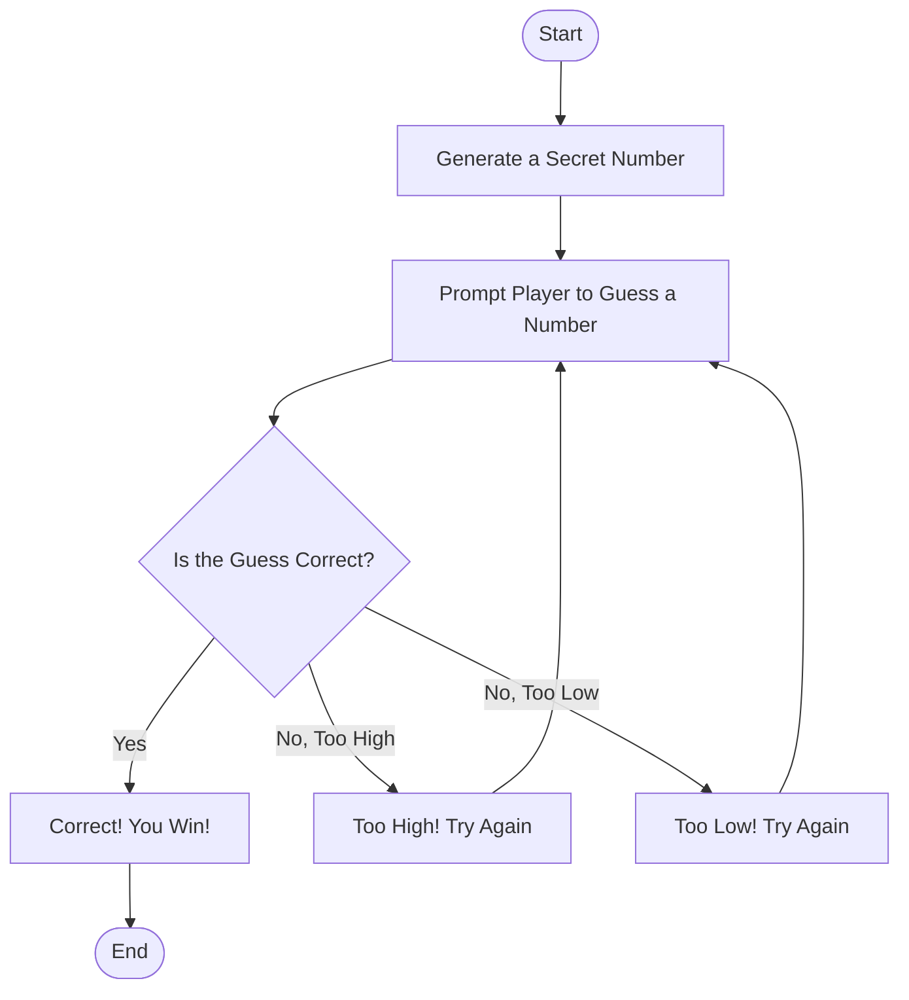

# Random Number Guessing Game Flowchart

```mermaid
flowchart TD
    A([Start]) --> B[Generate a Secret Number]
    B --> C[Prompt Player to Guess a Number]
    C --> D{Is the Guess Correct?}    
    D -- Yes --> E["Correct! You Win!"]
    E --> F([End])    
    D -- No, Too High --> G["Too High! Try Again"]
    D -- No, Too Low --> H["Too Low! Try Again"]    
    G --> C
    H --> C
```
